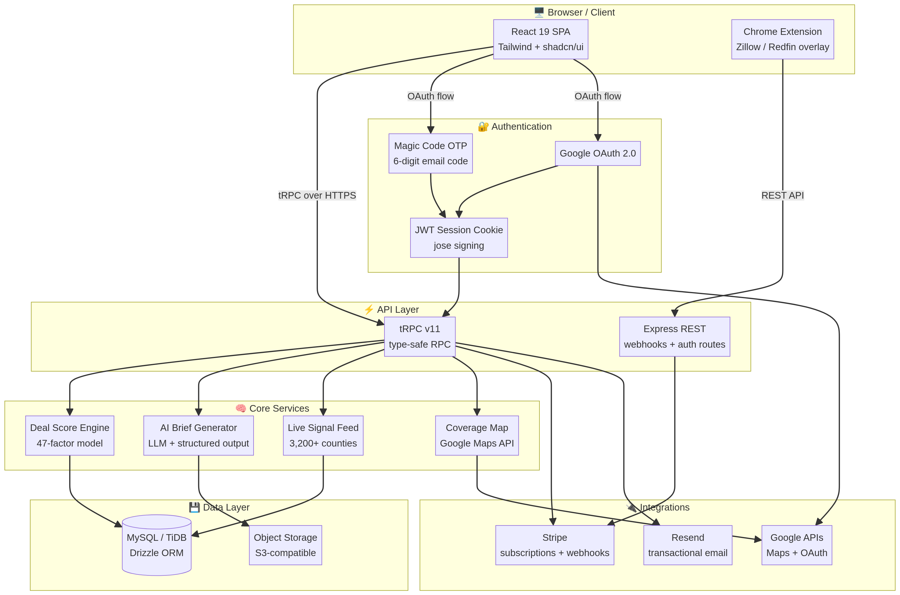

# SignalDesk — System Architecture

> **Showcase only.** This document describes component responsibilities and data flow direction. Internal business logic, database schemas, API routes, scoring weights, and proprietary algorithms are not disclosed.

---

## System Diagram

---

## Component Responsibilities

| Component | Responsibility |
|---|---|
| **React 19 SPA** | All user-facing UI, client-side routing (Wouter), and state management via tRPC React Query hooks |
| **Chrome Extension** | Injects deal scores and signal badges into Zillow and Redfin listing pages in real time |
| **tRPC v11 Layer** | Type-safe RPC contract between client and server — no manual REST routes, no schema files, no code generation |
| **Express REST Layer** | Handles OAuth callbacks, Stripe webhooks, and email auth routes that require raw body access |
| **Deal Score Engine** | Computes a 1–100 property score from 47 weighted factors across 5 dimensions |
| **AI Brief Generator** | Calls the LLM service with structured output constraints, produces ARV analysis, rehab estimate, and exit strategies |
| **Live Signal Feed** | Aggregates and ranks newly scored properties for the authenticated user's deal feed |
| **Coverage Map** | Renders county-level distress data on an interactive Google Maps layer |
| **Magic Code Auth** | Passwordless email OTP — generates a 6-digit code, sends via Resend, verifies and issues a JWT session cookie |
| **Google OAuth** | Standard OAuth 2.0 flow — exchanges code for profile, upserts user, issues JWT session cookie |
| **JWT Session Layer** | Signs and validates session cookies using `jose` — all protected tRPC procedures validate the cookie on every request |
| **Stripe Integration** | Manages subscription checkout sessions, plan upgrades/downgrades, and webhook-driven subscription lifecycle events |
| **Resend Integration** | Sends magic code emails and transactional notifications (subscription confirmations, brief ready alerts) |
| **TiDB / MySQL** | Stores users, subscriptions, property scores, signal records, and brief metadata — queried via Drizzle ORM |
| **S3 Object Storage** | Stores AI-generated brief PDFs and uploaded assets — referenced by key in the database |

---

## Data Flow Summary

The client communicates exclusively through the tRPC layer for all application data. Authentication is handled via two independent paths: a passwordless email OTP flow (Magic Code) and Google OAuth 2.0. Both paths issue a signed JWT session cookie that is validated on every protected tRPC procedure call.

The Deal Score Engine evaluates incoming property signals against a weighted factor model and persists results to the database. The AI Brief Generator is invoked on demand — it calls the LLM service with structured JSON output constraints, stores the resulting PDF in object storage, and returns the storage key to the client.

Stripe webhooks arrive at a dedicated Express endpoint registered before the JSON body parser middleware, preserving raw body integrity for HMAC signature verification. The webhook handler processes subscription lifecycle events and updates the user's `subscriptionTier` field in the database.

---

## Security Posture

The server applies the following hardening measures, in order of middleware registration:

1. `trust proxy` — enables accurate IP detection behind the Manus Cloud reverse proxy
2. `express-rate-limit` — global rate limiter using the library's default IPv6-safe key generator
3. `express.raw()` — registered only for the Stripe webhook route, before `express.json()`
4. `express.json()` — applied to all other API routes
5. `protectedProcedure` — validates the JWT session cookie on every tRPC call that requires authentication
6. CORS — restricted to the frontend origin
7. Helmet — standard HTTP security headers

---

## Deployment

SignalDesk is deployed on **Manus Cloud** with the following infrastructure:

| Resource | Configuration |
|---|---|
| Hosting | Manus Cloud (auto-scaling, managed TLS) |
| Database | TiDB (MySQL-compatible, managed, horizontal scaling) |
| Object Storage | S3-compatible (managed, CDN-backed) |
| Domain | signaldeskai-dev.manus.space |

---

<!-- Built by Ahmad · SignalDesk v1.0 · May 2026 -->
