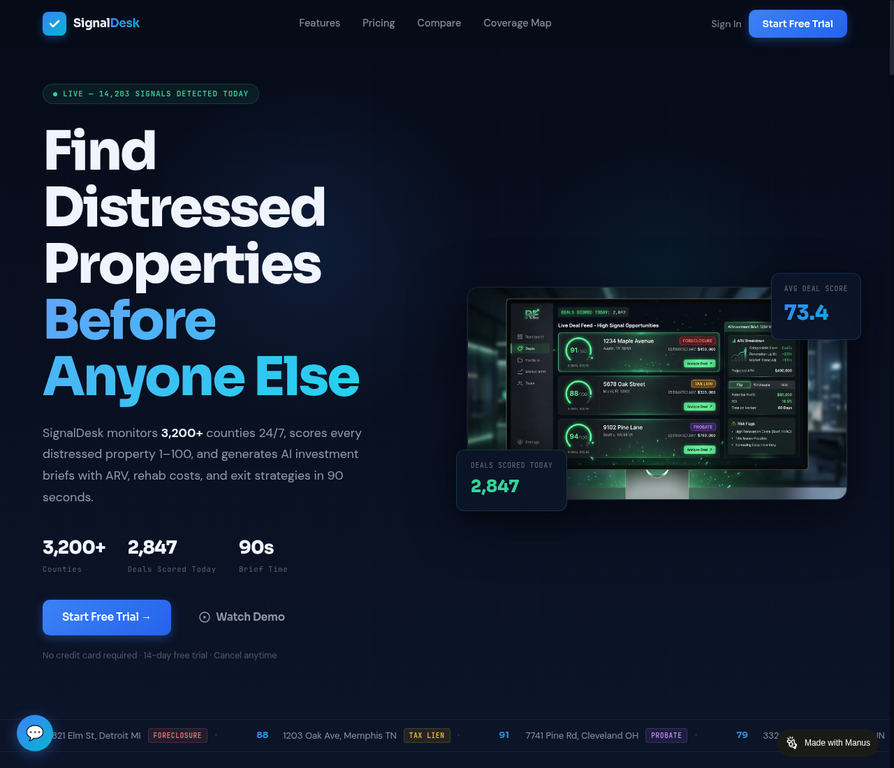
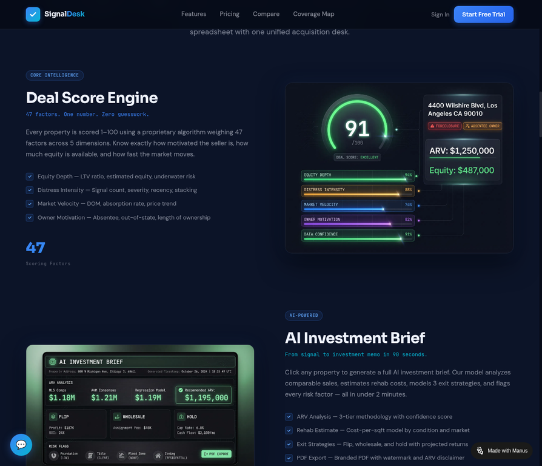
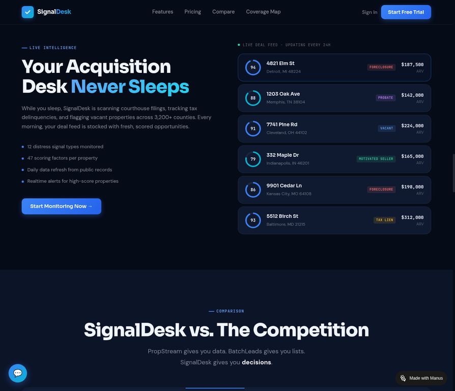
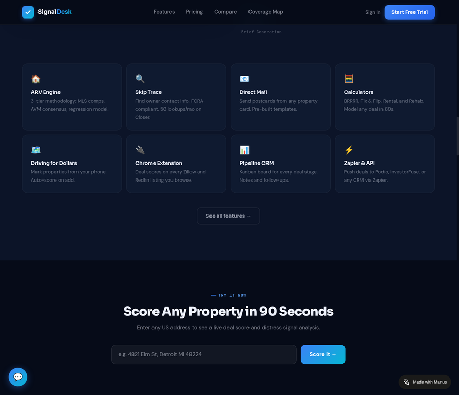
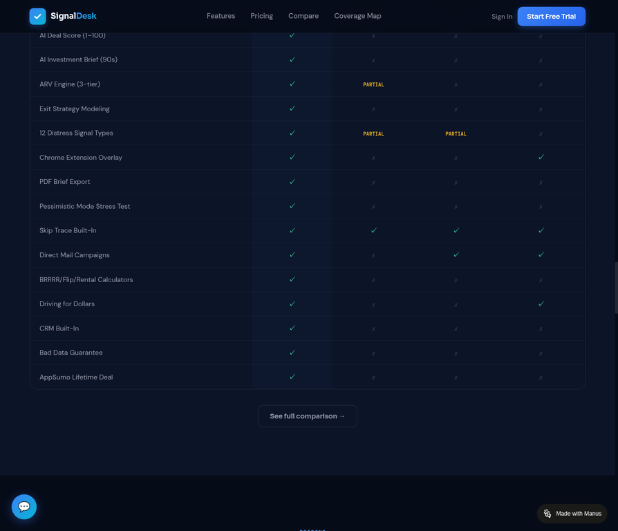
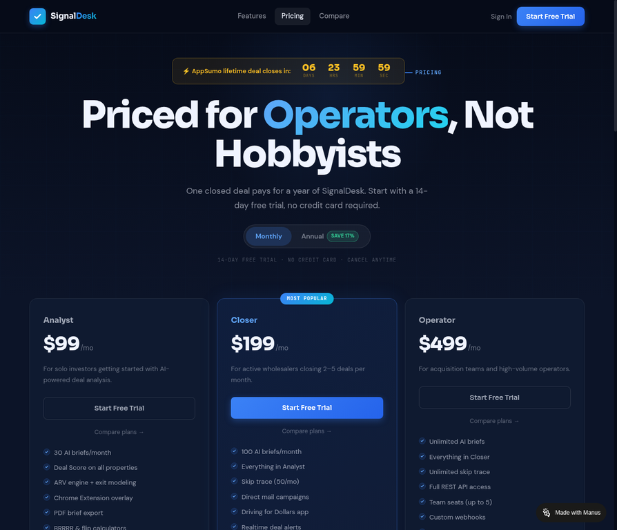
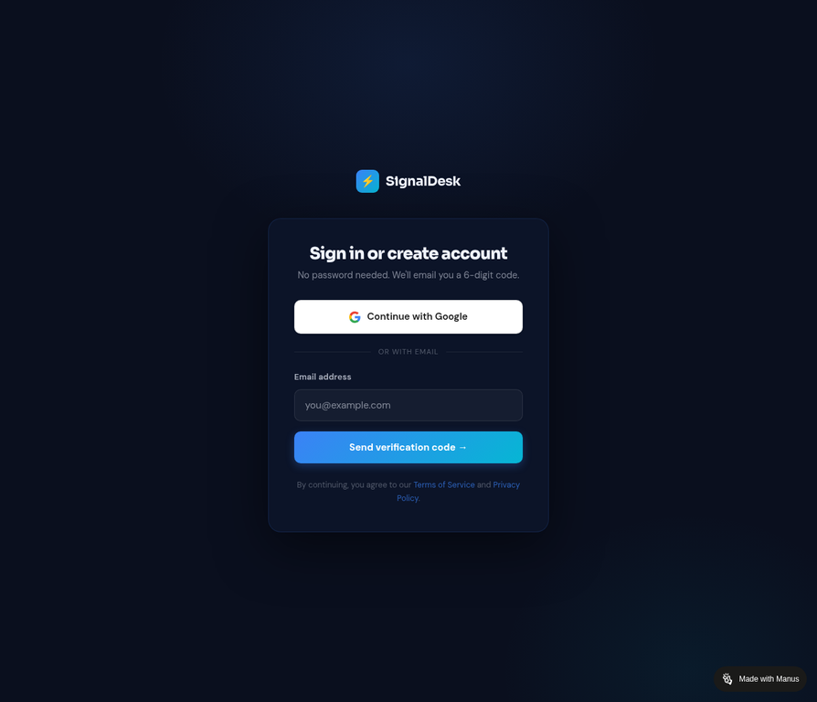

# SignalDesk

### The Autonomous Acquisition Desk for Real Estate Investors

**Find distressed properties. Score every deal. Generate AI investment briefs in 90 seconds.**

---

## What Is SignalDesk?

SignalDesk is a **decision intelligence platform** for real estate investors. It continuously monitors 3,200+ U.S. counties for distressed property signals — foreclosures, tax liens, probate filings, USPS vacancy flags, and 8 more — then scores every property 1–100 using a proprietary 47-factor algorithm and generates a complete AI investment brief in under 90 seconds.

The platform replaces PropStream, BatchLeads, and manual spreadsheet workflows with a single unified acquisition desk. Investors stop spending 4–6 hours per property on research and start spending 90 seconds per property on decisions.

---

## Screenshots

### Hero — Find Distressed Properties Before Anyone Else

### Deal Score Engine + AI Investment Brief

### Live Deal Feed — Updating Every 24 Hours

### Feature Grid — Everything in One Platform

### SignalDesk vs. The Competition

### Pricing — Three Tiers for Every Operator

### Sign In — Passwordless Magic Code Auth

---

## Core Features

| Feature | Description |
|---|---|
| **Deal Score Engine** | 47-factor scoring model across equity depth, distress intensity, market velocity, owner motivation, and data confidence |
| **AI Investment Brief** | Full investment memo in 90 seconds: ARV analysis, rehab estimate, 3 exit strategies, risk flags, PDF export |
| **Live Signal Feed** | 12 distress signal types monitored across 3,200+ counties — foreclosure, tax lien, probate, vacant, and more |
| **ARV Engine** | 3-tier methodology: MLS comps + AVM consensus + neighborhood regression, with confidence score |
| **Chrome Extension** | Injects deal scores directly onto Zillow and Redfin listing pages |
| **Pipeline CRM** | Kanban board for every deal stage with notes and follow-up tracking |
| **Skip Trace** | FCRA-compliant owner contact lookup built in |
| **Direct Mail** | Send postcards from any property card with pre-built templates |
| **Calculators** | BRRRR, Fix & Flip, Rental, and Rehab — model any deal in 60 seconds |
| **Driving for Dollars** | Mark properties from your phone, auto-scored on add |
| **Zapier & API** | Push deals to Podio, InvestorFuse, Follow Up Boss, or any CRM |
| **Bad Data Guarantee** | 1-click Autopsy button — data error refund within 24 hours |

---

## System Architecture

See [ARCHITECTURE.md](./ARCHITECTURE.md) for the full component breakdown and data flow description.

---

## Technology Stack

| Layer | Technology |
|---|---|
| Frontend | React 19, TypeScript 5.9, Tailwind CSS 4, shadcn/ui |
| API Contract | tRPC v11 (end-to-end type safety, no REST boilerplate) |
| Backend | Node.js 22, Express 4 |
| Database | MySQL / TiDB via Drizzle ORM |
| Auth | Passwordless Magic Code OTP + Google OAuth 2.0 |
| Payments | Stripe (subscriptions, webhooks, checkout) |
| Email | Resend (transactional) |
| Storage | S3-compatible object storage |
| Maps | Google Maps JavaScript API |
| Testing | Vitest |
| Deployment | Manus Cloud |

See [TECH_STACK.md](./TECH_STACK.md) for the full rationale behind each choice.

---

## Pricing

| Plan | Price | Best For |
|---|---|---|
| **Analyst** | $99/mo | Solo investors, 30 AI briefs/month |
| **Closer** | $199/mo | Active wholesalers, 100 briefs, skip trace, direct mail |
| **Operator** | $499/mo | Acquisition teams, unlimited briefs, full API, team seats |
| **AppSumo Lifetime** | $129 one-time | Closer plan forever — limited to 200 licenses |

---

## Competitive Position

SignalDesk is the only platform that combines deal scoring, AI brief generation, and a full acquisition workflow in one product. PropStream and BatchLeads sell raw data. SignalDesk sells decisions.

| | SignalDesk | PropStream | BatchLeads | DealMachine |
|---|---|---|---|---|
| AI Deal Score | ✓ | — | — | — |
| AI Investment Brief | ✓ | — | — | — |
| ARV Engine (3-tier) | ✓ | Basic | — | — |
| Exit Strategy Modeling | ✓ | — | — | — |
| Chrome Extension | ✓ | — | — | ✓ |
| Pipeline CRM | ✓ | — | — | — |
| Bad Data Guarantee | ✓ | — | — | — |
| AppSumo Lifetime Deal | ✓ | — | — | — |

---

## Live Demo

**[signaldeskai-dev.manus.space](https://signaldeskai-dev.manus.space)**

No credit card required. Sign in with email (magic code) or Google.

---

## Documents in This Repository

| File | Description |
|---|---|
| [ARCHITECTURE.md](./ARCHITECTURE.md) | System diagram and component responsibilities |
| [PRODUCT_BRIEF.md](./PRODUCT_BRIEF.md) | Investor one-pager: problem, insight, solution, differentiators |
| [TECH_STACK.md](./TECH_STACK.md) | Technology choices with rationale |
| [METRICS.md](./METRICS.md) | Traction metrics and milestones |
| [DEMO_GUIDE.md](./DEMO_GUIDE.md) | 5-minute Loom walkthrough script |
| [DO_NOT_PUBLISH.md](./DO_NOT_PUBLISH.md) | Sensitive content checklist — read before making public |
| [LICENSE](./LICENSE) | Proprietary — All Rights Reserved |

---

Built by **Ahmad** · Solutionist and Advisor · May 2026

<!-- Built by Ahmad · SignalDesk v1.0 · May 2026 -->
